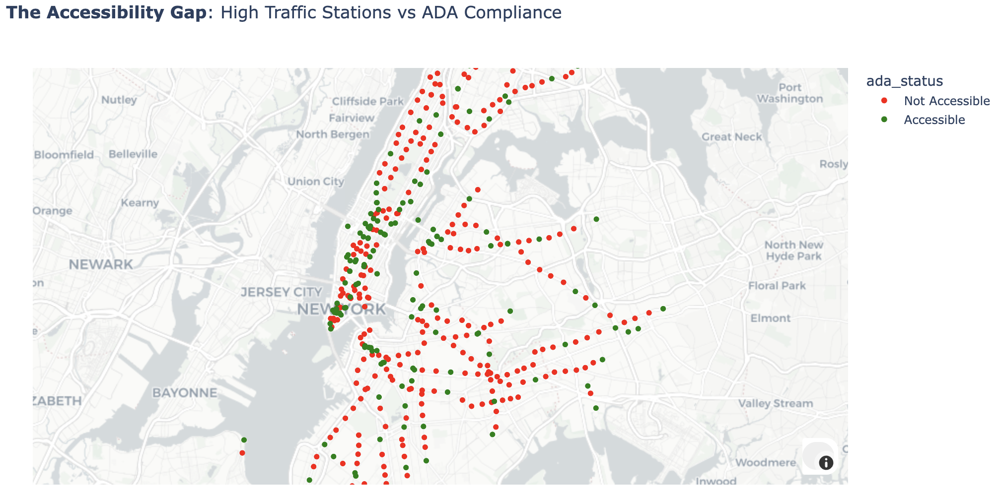
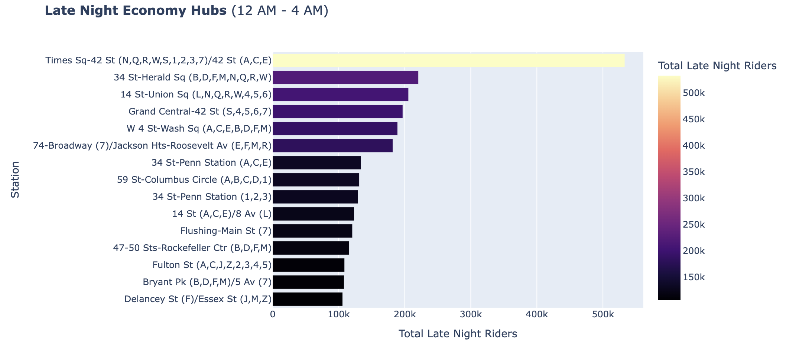
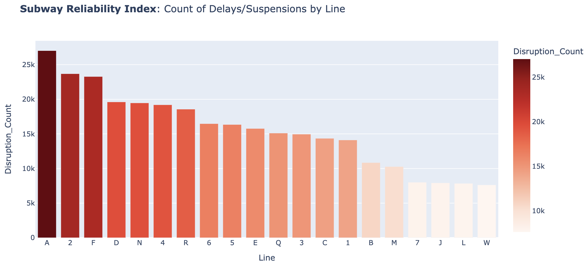
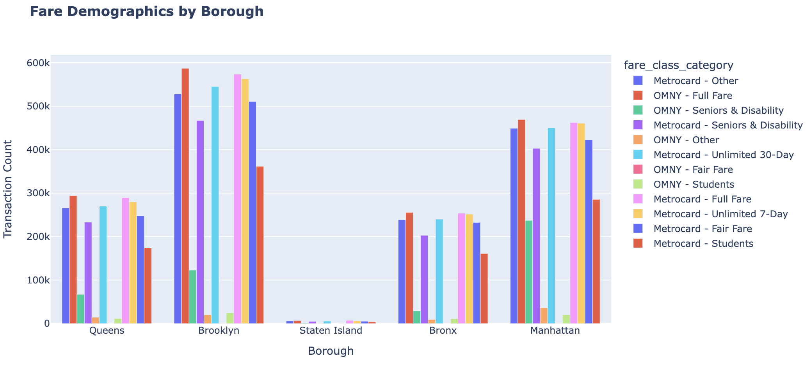
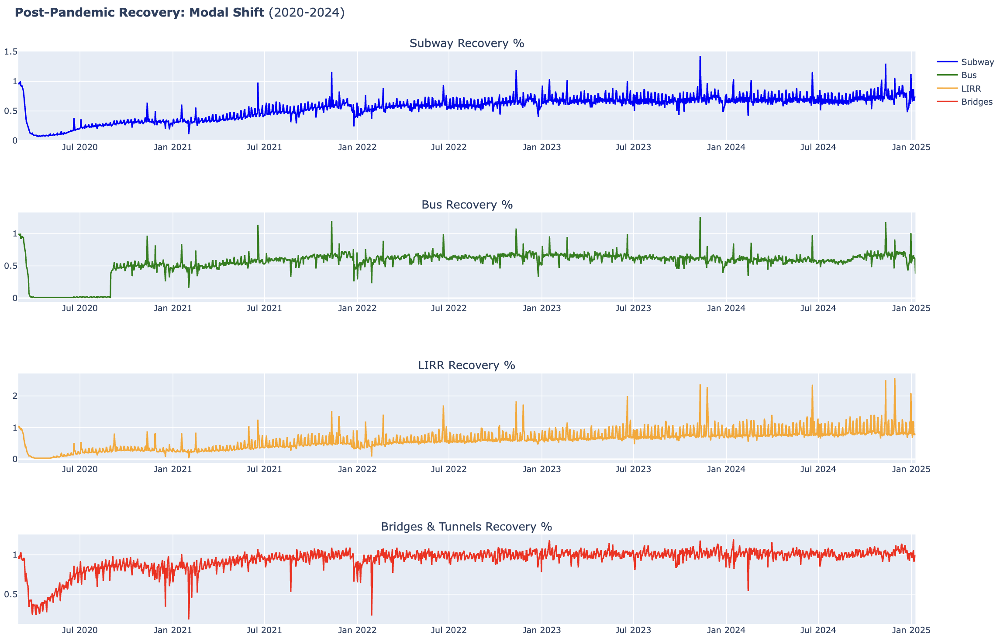

# MTAnalytics

**MTAnalytics** is a big data analytics and machine learning project that analyzes the **NYC MTA Subway system** to uncover insights around ridership patterns, system reliability, accessibility gaps, and post-pandemic recovery. The project demonstrates how large-scale urban transit data can be processed, analyzed, and modeled to support **data-driven transportation planning**.

This repository hosts the **Kaggle notebook**, core analysis workflow, and selected visual outputs.

---

## 🚇 Project Overview

- Analyzed **100GB+** of NYC MTA operational data (2008–2025)
- Processed data for **472+ subway stations** using distributed computing
- Built a **station-level ridership forecasting model**
- Generated actionable insights related to **equity, reliability, and efficiency**

---

## 🧩 Data & Tools

### Data Sources
- Hourly Subway Ridership
- Origin–Destination (OD) Trip Data
- Service Alerts (delays & suspensions)
- Station Metadata (boroughs, ADA accessibility)
- Post-pandemic daily ridership metrics

> Data sourced from **NYC Open Data / data.gov**

### Technology Stack
- **Apache Spark / PySpark** – large-scale data processing
- **Pandas** – reference data handling
- **XGBoost** – ridership prediction
- **SHAP** – model interpretability
- **Plotly, Matplotlib, Folium** – visual analytics

---

## 📊 Key Analyses & Visuals

> The following visualizations represent the **core analytical outputs** of the project. Each graph is paired with concrete findings derived from large-scale MTA data.

### 1. Accessibility Gap (Ridership vs ADA Compliance)



This map compares station ridership volume with ADA accessibility to identify equity gaps.

**Key Results:**
- Many of the **highest-ridership stations are not ADA accessible**
- Manhattan shows the largest concentration of busy yet inaccessible stations
- Accessibility investments are misaligned with actual rider demand

---

### 2. Borough Connectivity Flow


A heatmap of origin–destination trips showing how riders move across boroughs.

**Key Results:**
- **Intra-borough trips dominate** inter-borough travel by 3–5×
- Manhattan acts as a **central transfer bottleneck** for most cross-borough trips
- Direct outer-borough connectivity (e.g., Brooklyn–Queens) is limited

---

### 3. Late-Night Economy Hubs (12 AM – 4 AM)



This visualization highlights stations with the highest overnight ridership.

**Key Results:**
- Times Square is the **largest late-night hub**, far exceeding others
- Overnight demand clusters around **entertainment districts and transfer hubs**
- Indicates sustained transit dependence among essential and night-shift workers

---

### 4. Subway Reliability Index



Service alert data is aggregated to measure disruption frequency by subway line.

**Key Results:**
- A, 2, and F lines show the **highest disruption counts**
- Shared infrastructure creates **cascading failures** across major routes
- Isolated lines (L, W, J) demonstrate higher reliability

---

### 5. Fare Demographics by Borough



Payment types and fare categories are analyzed to reveal demographic travel patterns.

**Key Results:**
- Brooklyn leads in **OMNY (contactless) adoption**
- Manhattan has higher **student fare usage**, reflecting university density
- Bronx shows elevated **senior and disability fare usage**

---

### 6. Post-Pandemic Ridership Recovery (2020–2025)



Time-series plots compare ridership recovery across transit modes.

**Key Results:**
- Subway ridership has stabilized at **~60–70% of pre-2019 levels**
- Bridges and tunnels recovered fastest and often exceed pre-pandemic usage
- Suggests a long-term shift toward private vehicles and remote work

---

### 7. XGBoost Feature Importance (SHAP)


SHAP values are used to interpret the ridership prediction model.

**Key Results:**
- **Station ID** is the strongest predictor, indicating location dominance
- Hour of day and borough significantly impact ridership
- Day-of-week effects are comparatively weak

---

### 8. Hourly Ridership Prediction (XGBoost)


The trained XGBoost model predicts hourly ridership at the station level.

**Key Results:**
- Successfully captures **rush-hour and off-peak demand patterns**
- Produces station-specific demand forecasts
- Enables data-driven scheduling and capacity planning

---

## 🤖 Machine Learning

- **Model:** XGBoost Regressor
- **Target:** Hourly ridership per station
- **Granularity:** Station-level, hour-by-hour

### Feature Importance (SHAP)


Key drivers of ridership include **station location**, **borough**, and **hour of day**, emphasizing the importance of station-specific and time-aware scheduling.

---

## 🚀 Applications

- Dynamic train frequency planning
- Station-level staffing optimization
- Predictive maintenance prioritization
- Accessibility investment planning

---

## 📂 Repository Structure

The repository is organized to clearly separate notebooks, visual outputs, and documentation.

```
MTAnalytics/
│── notebook/
│   └── mtanalytics.ipynb   # Kaggle notebook with full analysis
│
│── visuals/                           # Exported plots used in README
│   ├── accessibility_gap.png
│   ├── borough_connectivity.png
│   ├── late_night_hubs.png
│   ├── reliability_index.png
│   ├── fare_demographics.png
│   ├── recovery_trends.png
│   ├── shap_importance.png
│   └── ridership_prediction.png
│
│── README.md                          # Project documentation
```

---

## 📜 License

This project is for academic and educational purposes. Data is provided by NYC Open Data / MTA.

